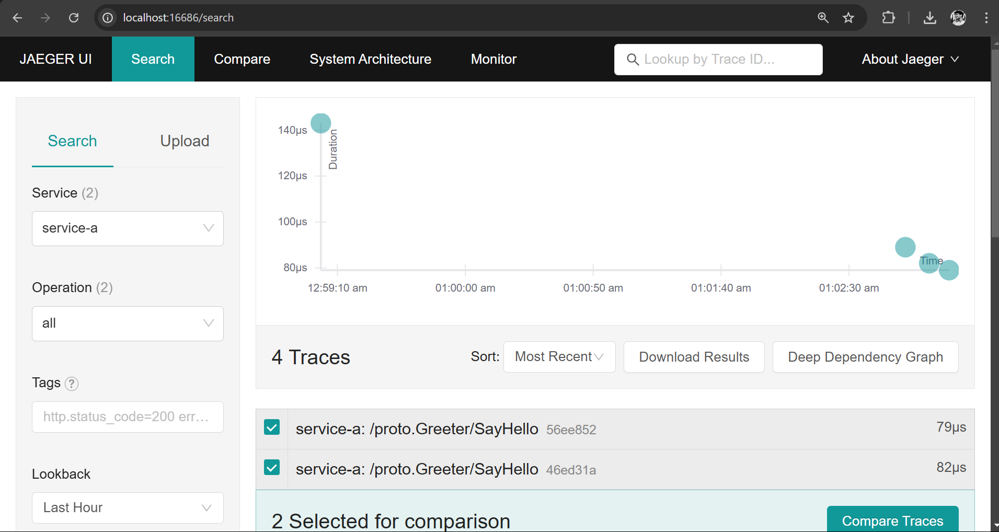

# Cloud-Native Tracing with OpenTelemetry & Jaeger


A cloud-native **distributed tracing** implementation using **Golang, OpenTelemetry, gRPC, and Jaeger**. This project
enables end-to-end tracing for microservices, helping in debugging, performance monitoring, and request visualization.

## 🚀 Features

- 🔍 **Distributed tracing** using OpenTelemetry SDK in Golang.
- 📡 **gRPC service** instrumented with OpenTelemetry spans.
- 🎯 **Jaeger backend** for trace collection and visualization.
- 🌐 **OTLP exporter** for efficient trace reporting.
- 🐳 **Dockerized setup** for easy deployment.

## 📦 Tech Stack

- **Golang** (1.20+)
- **gRPC** (Google Remote Procedure Call)
- **OpenTelemetry** (OTEL SDK & Collector)
- **Jaeger** (Distributed Tracing System)
- **Docker** (Containerized deployment)

## 🛠️ Setup & Installation

### 1️⃣ Clone the Repository

```sh
git clone https://github.com/bravo1goingdark/cloud-tracing-opentelemetry.git
cd cloud-tracing-opentelemetry
```

### 2️⃣ Start Jaeger & OpenTelemetry Collector with Docker Compose

```shell
docker-compose up -d --build
```

### 3️⃣ Send a gRPC Request

```shell
grpcurl -plaintext -d '{"name": "Ashutosh"}' localhost:50051 proto.Greeter/SayHello
```

### Expected Output

```shell
{
  "message": "Hello Ashutosh"
}
```

### View Traces in Jaeger
```shell
http://localhost:16686
```



